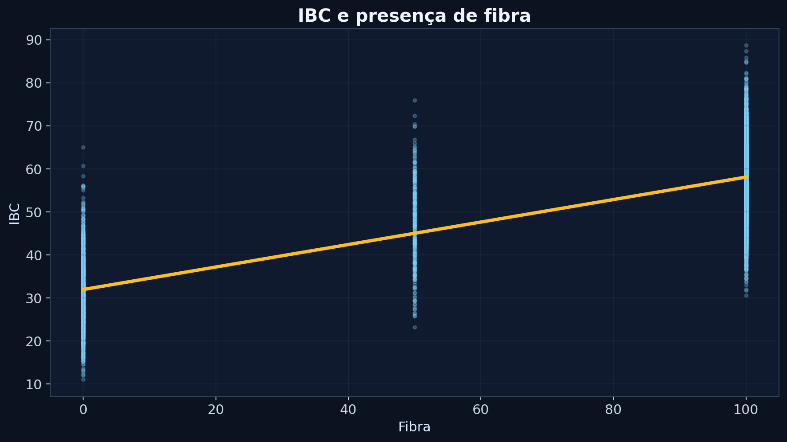
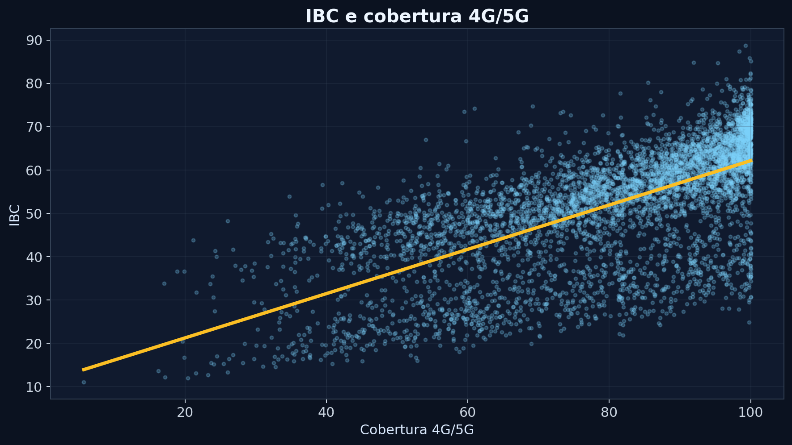
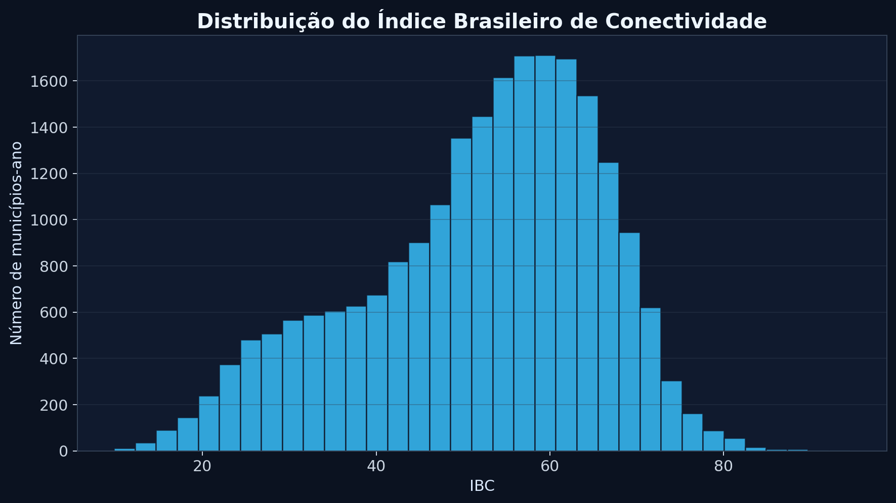
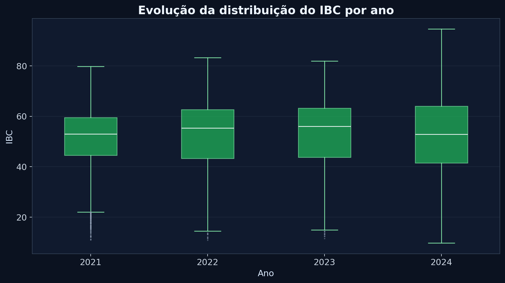
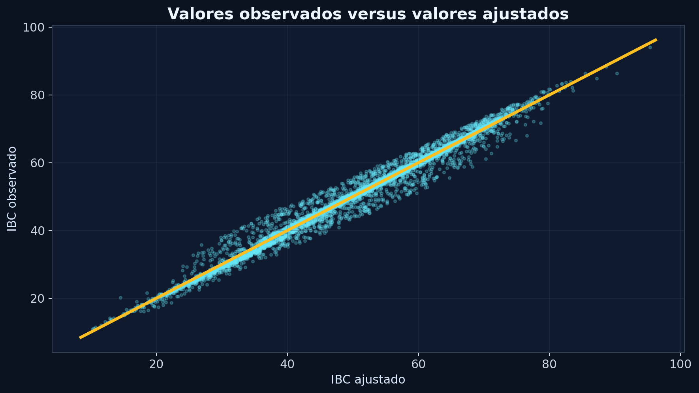
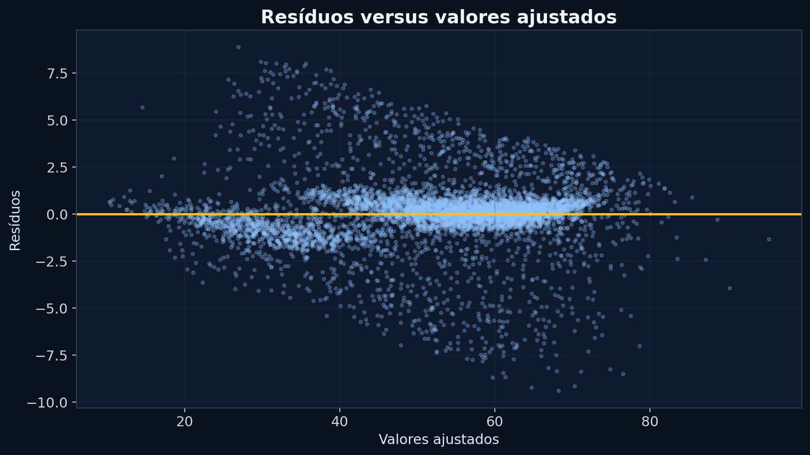
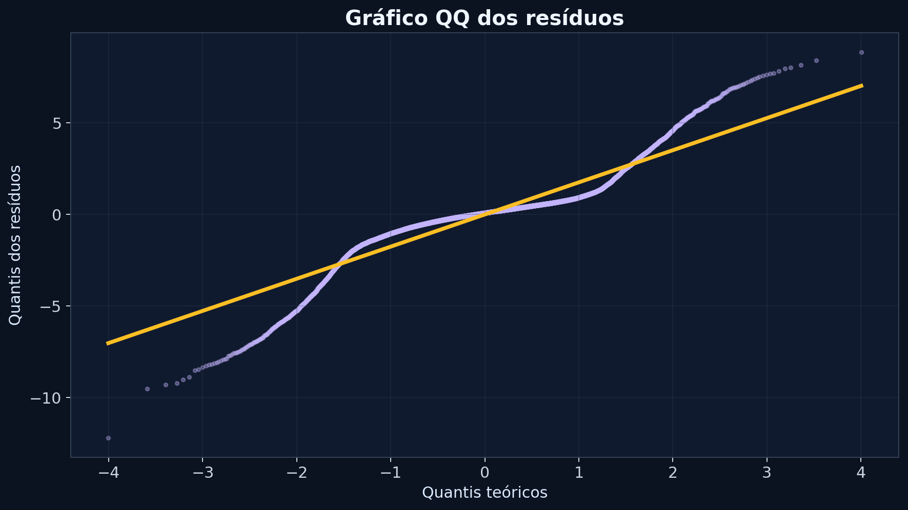
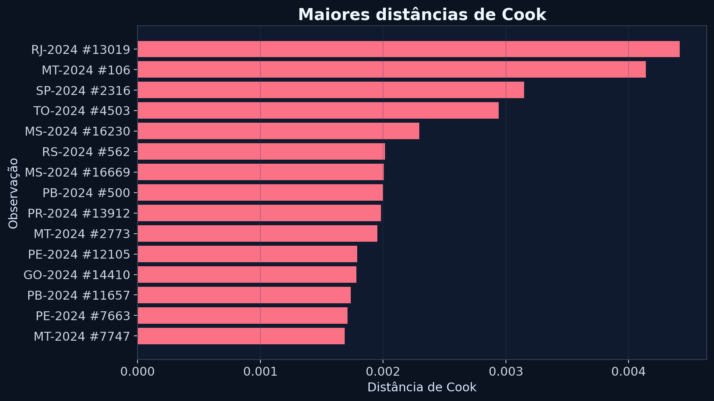

## Índice Brasileiro de Conectividade {.cover-slide}

Modelos Lineares I · Regressão Linear Múltipla

<h1>Índice Brasileiro de Conectividade</h1>

Fatores associados ao IBC dos municípios brasileiros

Base pública da Anatel · 2021 a 2024

Milena Branco Labre de Oliveira Rodrigues

22.280

observações município-ano

5.570

municípios por ano

## Introdução: por que estudar conectividade?

Introdução

<h3>Inclusão digital</h3>
A conectividade é condição para acesso a estudo, trabalho, serviços públicos e informação.

<h3>Desigualdade territorial</h3>
Municípios e UFs podem apresentar níveis diferentes de infraestrutura digital.

<h3>Questão estatística</h3>
O IBC permite investigar quais dimensões de infraestrutura e competitividade se associam ao desempenho municipal.

## Problema de pesquisa

Introdução

Quais variáveis explicativas contribuem para explicar a variabilidade do Índice Brasileiro de Conectividade dos municípios brasileiros entre 2021 e 2024?

<b>Hipótese inicial:</b> maior cobertura 4G/5G, presença de fibra e densidade de serviços devem estar associadas a maiores valores de IBC.

## Objetivo do estudo

Introdução

<h3>Objetivo geral</h3>
Ajustar um modelo de regressão linear múltipla tendo o IBC como variável resposta e os indicadores de infraestrutura e competitividade como variáveis explicativas.

<h3>Objetivos específicos</h3>
Descrever as variáveis, avaliar gráficos de dispersão, ajustar modelos, examinar summary, ANOVA, FIV e resíduos.

## Material: base de dados

Material e Métodos

<b>Fonte</b>Anatel

<b>Unidade</b>Município-ano

<b>Período</b>2021-2024

<b>N</b>22.280

A base utilizada não é nativa do R. Ela reúne informações municipais sobre o Índice Brasileiro de Conectividade e indicadores de infraestrutura e competitividade.

## Variáveis utilizadas

Material e Métodos

<h3>Variável resposta</h3>
<b>ibc</b> Índice Brasileiro de Conectividade.

<h3>Infraestrutura</h3>
cobertura_pop_4g5g, fibra, densidade_smp, densidade_scm e adensamento_estacoes.

<h3>Competitividade e tempo</h3>
hhi_smp, hhi_scm e ano da observação.

## Metodologia adotada

Material e Métodos

y = Xβ + ε

<h3>Modelo linear múltiplo</h3>
Seja Y o IBC. O modelo considera Y como variável resposta explicada pelas variáveis de infraestrutura, competitividade e pelo controle temporal de ano.

<h3>Estimação e diagnóstico</h3>
Foram usados mínimos quadrados, summary, ANOVA, FIV, resíduos, QQ-plot e distância de Cook.

## Forma do modelo final

Material e Métodos

IBC = β0 + β1 Cobertura4G/5G + β2 Fibra + β3 Dens.SMP + β4 HHI.SMP + β5 Dens.SCM + β6 HHI.SCM + β7 Estações + Ano + ε

As variáveis quantitativas foram padronizadas no modelo final para facilitar a comparação da magnitude dos coeficientes.

## Pressupostos avaliados

Material e Métodos

<h3>Pressupostos avaliados</h3>

<ul>
<li>Linearidade</li>
<li>Independência dos erros</li>
<li>Homocedasticidade</li>
<li>Normalidade dos resíduos</li>
<li>Ausência de multicolinearidade severa</li>
</ul>

<h3>Como foram avaliados</h3>

Foram utilizados gráficos de resíduos, QQ-plot, Fator de Inflação da Variância (FIV), distância de Cook e teste de Breusch-Pagan.

## Dispersão: IBC e fibra

O gráfico sugere relação linear positiva entre a variável explicativa fibra e a variável resposta IBC.

## Dispersão: IBC e cobertura 4G/5G

Resultados

A cobertura 4G/5G também apresenta relação positiva com a variável resposta IBC.

## Distribuição do IBC

A distribuição mostra concentração em valores intermediários, com municípios em níveis baixos e altos de conectividade.

## IBC por ano

Resultados

A comparação por ano justifica a inclusão do controle temporal no modelo.

## Saída do R: summary(modelo_final)

Resultados

<pre class="console">Call:
lm(formula = ibc ~ cobertura_pop_4g5g_z + fibra_z + densidade_smp_z +
    hhi_smp_z + densidade_scm_z + hhi_scm_z + adensamento_estacoes_z + ano,
    data = dados)

Residual standard error: 1.888 on 22269 degrees of freedom
Multiple R-squared: 0.9815,    Adjusted R-squared: 0.9815
F-statistic: 1.179e+05 on 10 and 22269 DF,  p-value: < 2.2e-16</pre>

<b>R² ajustado</b>0,9815

<b>Erro residual</b>1,888

<b>F global</b>117.920

<b>p-valor</b>&lt; 2,2e-16

O modelo apresentou R² ajustado igual a 0,9815, indicando que aproximadamente 98,15% da variabilidade observada do IBC é explicada pelas variáveis incluídas no modelo.

## Coeficientes: summary(modelo_final)

Resultados

<table class="tbl compact"><thead><tr><th>Termo</th><th>Estimativa</th><th>Erro padrão</th><th>t</th><th>p-valor</th></tr></thead><tbody>
<tr><td>Intercepto</td><td>51,758</td><td>0,027</td><td>1940,4</td><td>&lt;0,001</td></tr>
<tr><td>Ano 2022</td><td>0,109</td><td>0,037</td><td>3,0</td><td>0,003</td></tr>
<tr><td>Ano 2023</td><td>-0,013</td><td>0,037</td><td>-0,4</td><td>0,715</td></tr>
<tr><td>Ano 2024</td><td>0,496</td><td>0,046</td><td>10,7</td><td>&lt;0,001</td></tr>
<tr><td>Cobertura 4G/5G (z)</td><td>3,631</td><td>0,016</td><td>226,2</td><td>&lt;0,001</td></tr>
<tr><td>Fibra (z)</td><td>7,783</td><td>0,014</td><td>553,9</td><td>&lt;0,001</td></tr>
<tr><td>Densidade SMP (z)</td><td>3,393</td><td>0,017</td><td>195,8</td><td>&lt;0,001</td></tr>
<tr><td>HHI SMP (z)</td><td>1,623</td><td>0,014</td><td>113,9</td><td>&lt;0,001</td></tr>
<tr><td>Densidade SCM (z)</td><td>2,812</td><td>0,016</td><td>172,9</td><td>&lt;0,001</td></tr>
<tr><td>HHI SCM (z)</td><td>1,247</td><td>0,013</td><td>95,7</td><td>&lt;0,001</td></tr>
<tr><td>Adensamento estações (z)</td><td>2,429</td><td>0,016</td><td>151,4</td><td>&lt;0,001</td></tr>
</tbody></table>

Coeficientes positivos indicam aumento esperado no IBC quando a variável explicativa aumenta, mantendo as demais variáveis constantes. Para p-valor inferior a 0,05, rejeita-se H0: βj = 0.

## Interpretação dos coeficientes

Resultados

<h3>Fibra</h3>

O coeficiente estimado para a variável fibra foi positivo e estatisticamente significativo (p &lt; 0,001).

<h3>Interpretação</h3>

Mantidas constantes as demais variáveis do modelo, aumentos na variável fibra estão associados a aumentos esperados no Índice Brasileiro de Conectividade.

## ANOVA do modelo final

Resultados

<table class="tbl small"><thead><tr><th>Fonte</th><th>SQ</th><th>gl</th><th>F</th><th>p-valor</th></tr></thead><tbody>
<tr><td>Ano</td><td>493,8</td><td>3</td><td>46,2</td><td>&lt;0,001</td></tr>
<tr><td>Cobertura 4G/5G</td><td>182.334,3</td><td>1</td><td>51.149,7</td><td>&lt;0,001</td></tr>
<tr><td>Fibra</td><td>1.093.803,5</td><td>1</td><td>306.841,3</td><td>&lt;0,001</td></tr>
<tr><td>Densidade SMP</td><td>136.706,8</td><td>1</td><td>38.349,9</td><td>&lt;0,001</td></tr>
<tr><td>HHI SMP</td><td>46.227,7</td><td>1</td><td>12.968,1</td><td>&lt;0,001</td></tr>
<tr><td>Densidade SCM</td><td>106.555,6</td><td>1</td><td>29.891,7</td><td>&lt;0,001</td></tr>
<tr><td>HHI SCM</td><td>32.619,3</td><td>1</td><td>9.150,6</td><td>&lt;0,001</td></tr>
<tr><td>Adensamento estações</td><td>81.666,7</td><td>1</td><td>22.909,7</td><td>&lt;0,001</td></tr>
<tr><td>Resíduo</td><td>79.382,8</td><td>22269</td><td></td><td></td></tr>
</tbody></table>
## Saída do R: anova(modelo_final)

Resultados

<pre class="console">

anova(modelo_final)

</pre>

A ANOVA confirma que todas as variáveis apresentaram contribuição estatisticamente significativa para o ajuste do modelo.

## Multicolinearidade: FIV

Resultados

<table class="tbl"><thead><tr><th>Variável</th><th>FIV</th><th>Leitura</th></tr></thead><tbody>
<tr><td>Cobertura 4G/5G</td><td>1,61</td><td>sem problema relevante</td></tr>
<tr><td>Fibra</td><td>1,21</td><td>sem problema relevante</td></tr>
<tr><td>Densidade SMP</td><td>1,56</td><td>sem problema relevante</td></tr>
<tr><td>HHI SMP</td><td>1,25</td><td>sem problema relevante</td></tr>
<tr><td>Densidade SCM</td><td>1,32</td><td>sem problema relevante</td></tr>
<tr><td>HHI SCM</td><td>1,06</td><td>sem problema relevante</td></tr>
<tr><td>Adensamento de estações</td><td>1,20</td><td>sem problema relevante</td></tr>
</tbody></table>

Como todos os FIV ficaram abaixo de 5, não há evidência forte de multicolinearidade problemática.

## Diagnóstico: observados x ajustados

Resultados

A proximidade dos pontos com a diagonal confirma visualmente o bom ajuste do modelo.

## Gráfico de resíduos

Resultados

Os resíduos permanecem centrados em torno de zero e não apresentam padrão sistemático evidente. Observa-se, entretanto, variação da dispersão ao longo dos valores ajustados, indicando possível heterocedasticidade.

## Teste de Breusch-Pagan

Resultados

<h3>Hipóteses</h3>

H₀: variância constante dos erros

H₁: heterocedasticidade

<h3>Resultado</h3>

BP = 7433

gl = 10

p-valor &lt; 0,001

Como o p-valor foi inferior a 0,05, rejeita-se H₀. Portanto, há indícios de heterocedasticidade nos resíduos.

## Normalidade e pontos influentes

Resultados

O QQ-plot indica desvios da normalidade nas caudas dos resíduos. Como a amostra é muito grande, esses desvios não comprometem substancialmente as inferências do modelo. As distâncias de Cook apresentaram valores baixos, não indicando observações excessivamente influentes.

## Verificação dos pressupostos

Resultados

<h3>Resíduos</h3>

<ul>
<li>Sem padrão sistemático evidente</li>
<li>Linearidade adequada</li>
<li>Indícios de heterocedasticidade</li>
</ul>

<h3>Diagnóstico geral</h3>

<ul>
<li>FIV &lt; 5</li>
<li>Sem multicolinearidade severa</li>
<li>R² ajustado = 0,9815</li>
<li>Breusch-Pagan: p &lt; 0,001</li>
</ul>

## Conclusões

Conclusão

 
<h3>Principais resultados</h3>
Fibra, cobertura 4G/5G, densidades SMP/SCM e adensamento de estações apresentaram coeficientes positivos e estatisticamente significativos no modelo final.

<h3>Modelo final</h3>
O modelo apresentou alto poder explicativo, com R² ajustado igual a <b>0,9815</b>.

<b>Limitação:</b> os resultados indicam associação estatística. Não se conclui causalidade apenas pelo ajuste de regressão linear.

